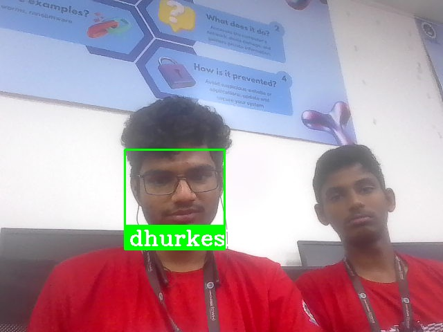

# Facial Recognition Suspect Detection System

This project is a facial recognition system designed for real-time suspect detection and alerting. It utilizes a webcam to capture live video, processes frames to detect faces, and compares them against a database of known suspects. 

## Key Features

- **Add Suspects**: Easily add new suspects by capturing multiple images and storing their facial encodings along with personal information.
- **Real-time Detection**: Continuously scans video frames for suspect faces, alerting when matches are found.
- **PDF Report Generation**: Automatically generates detailed PDF reports containing suspect information and images upon detection.
- **Email Notifications**: Sends email alerts with attached reports for immediate action by authorities.
- **Location Tracking**: Integrates location tracking to provide additional context for suspect sightings.

## Technologies Used

- OpenCV
- face_recognition
- NumPy
- ReportLab
- Geocoder
- smtplib and email
##Sample image
  
## Usage

1. Clone the repository.
2. Install dependencies using `pip install -r requirements.txt`.
3. Run the main script and follow the prompts to add new suspects or run the recognition program.

This project offers a comprehensive solution for enhancing security and law enforcement operations through efficient suspect detection and reporting.

